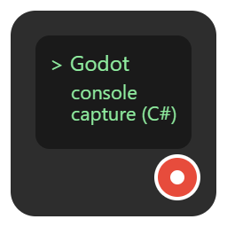

#  Godot ConsoleCapture (C#)

Provides a `ConsoleListener`-Node that allows you to listen to the output of StdOut and StdErr.

Additionally provides static helper methods to force-show a console window on Windows  
(Useful when debugging with the full Visual Studio IDE, See: <https://github.com/godotengine/godot-proposals/issues/8648> ).

## Installation

a) Install from Godots Asset-Lib (pending)

b) Clone as submodule into the Repos folder

```bash
git submodule init
git submodule add git@github.com:Alia5/Godot-ConsoleCapture-C-.git ./addons/ConsoleCapture
```

## Usage

### ConsoleListener-Node

1. Add the `ConsoleListener`-Node to your scene.
2. Connect the `ConsoleListener`-Node's `Output`-Signal to a method of your choice.

```csharp
using Godot;

public class MyNode : Node
{
    private string Text = "";
    public override void _Ready()
    {
        // ConsoleListener initializes ConsoleRedirect on TreeEnter.
        var consoleListener = new ConsoleListener();
        consoleListener.StdOut += (str) => {
            Text += str;
        };
        consoleListener.StdErr += (str) => {
            Text += str;
        };
        AddChild(consoleListener);

        // 
        GD.Print("Hello World!");
        // Text will now contain "Hello World!"
    }
}
```

### Enable Console Redirect without adding a Node

```csharp

    if (!ConsoleCapture.IsInitialized) {
        ConsoleCapture.Initialize();
    }

```

### Force-Show Console Window

**Only available on Windows**

```csharp
    if (!ConsoleCapture.NativeOutputRedirector.IsConsoleShown()) {
        ConsoleCapture.NativeOutputRedirector.ToggleConsole();
    }
```

## Additional Information

- Yes, this captures the StdOut and StdErr that is written to by Godot itself and `GD.Print`, `GD.PushErr`, etc. and is not based on file-reading
- Linux and MacOS should work in theory, but are untested.
- The ConsoleListener-Node is not a singleton (Autoload), you can add multiple instances to your scene.
- On Windows, StdOut and StdErr do not exist, when the application is not linked as a console application, except when the streams are redirected inside an existing console, (eg. `myBinary.exe > file.txt`), another process captures the streams like the Godot-Editor or VSCode, or a console is manually allocated.  
The full Visual Studio does not do any of this, so the native `GD.Print()` output is not shown.  
To circumvent this, the `ConsoleCapture.NativeOutputRedirector` allocs a console window using Win32s `AllocConsole()`, and is then able to capture the output.  
A brief flash of the console might be shown.
- When debugging with the full Visual Studio, the Console-Window is shown as soon as `ConsoleCapture` gets initialized (via creating a `ConsoleListener`-Node or manually calling `ConsoleCapture.Initialize()`).
- Until a `ConsoleListener`-Node is added to a scene, or `ConsoleCapture.Initialize()` is called, the output is not captured.  
`[ModuleInitializer]` is not used, as it is not supported in Godot-C#. See: <https://github.com/godotengine/godot/issues/78513>

## License

MIT

```license
Copyright (c) 2025 Peter Repukat

Permission is hereby granted, free of charge, to any person obtaining a copy
of this software and associated documentation files (the "Software"), to deal
in the Software without restriction, including without limitation the rights
to use, copy, modify, merge, publish, distribute, sublicense, and/or sell
copies of the Software, and to permit persons to whom the Software is
furnished to do so, subject to the following conditions:

The above copyright notice and this permission notice shall be included in all
copies or substantial portions of the Software.

THE SOFTWARE IS PROVIDED "AS IS", WITHOUT WARRANTY OF ANY KIND, EXPRESS OR
IMPLIED, INCLUDING BUT NOT LIMITED TO THE WARRANTIES OF MERCHANTABILITY,
FITNESS FOR A PARTICULAR PURPOSE AND NONINFRINGEMENT. IN NO EVENT SHALL THE
AUTHORS OR COPYRIGHT HOLDERS BE LIABLE FOR ANY CLAIM, DAMAGES OR OTHER
LIABILITY, WHETHER IN AN ACTION OF CONTRACT, TORT OR OTHERWISE, ARISING FROM,
OUT OF OR IN CONNECTION WITH THE SOFTWARE OR THE USE OR OTHER DEALINGS IN THE
SOFTWARE.
```
